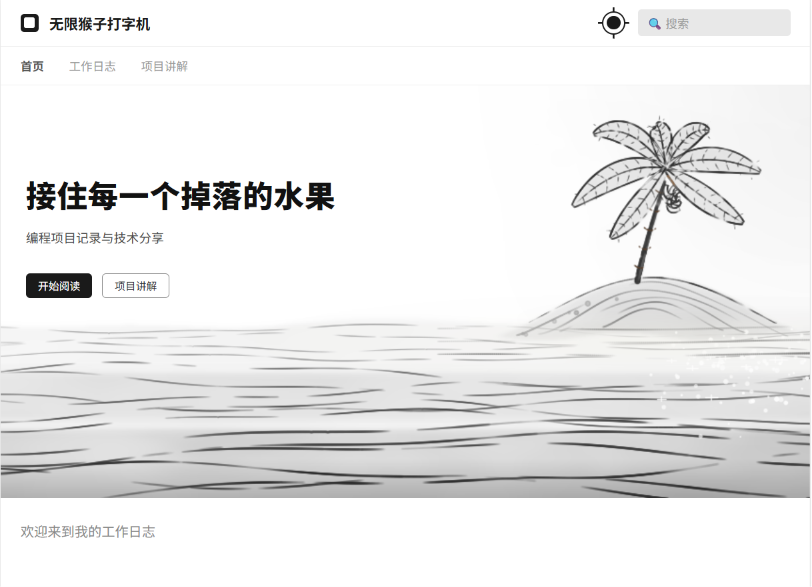
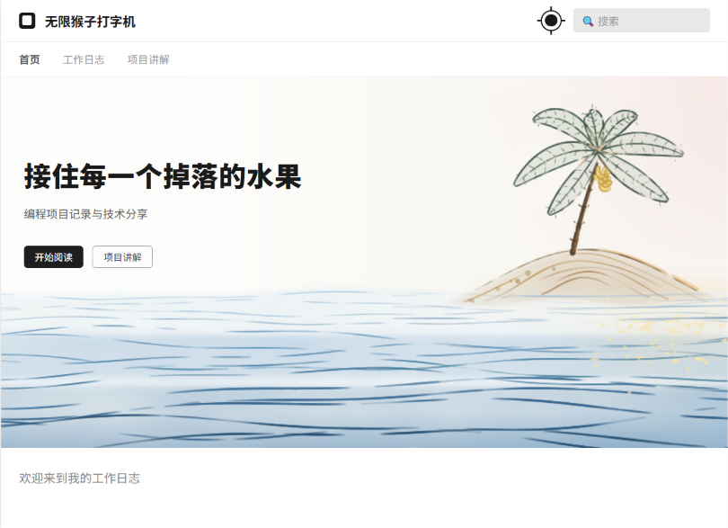
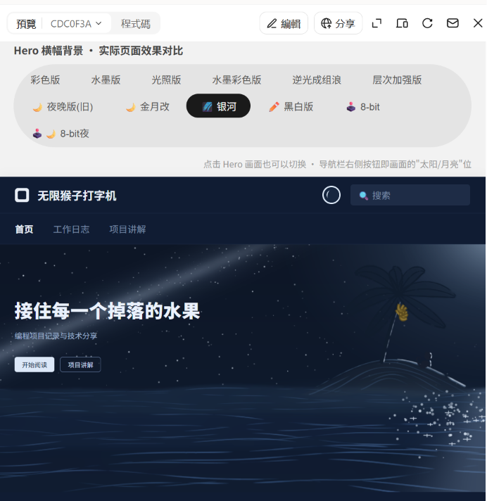
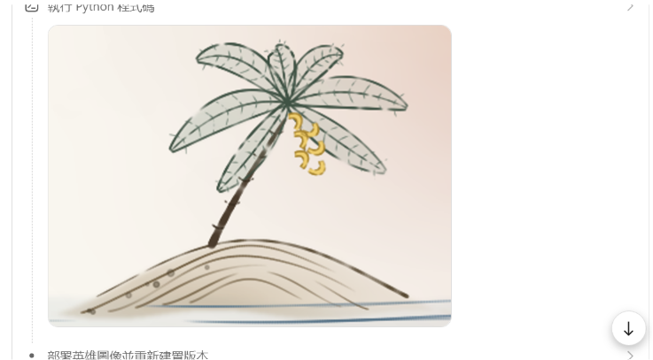
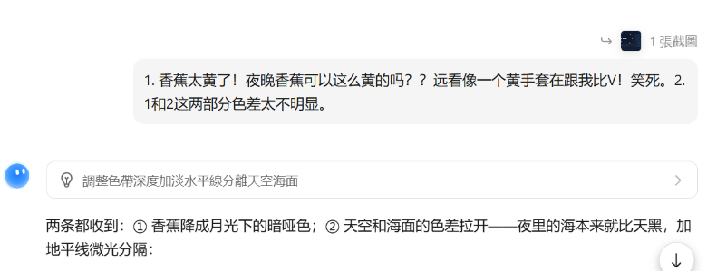
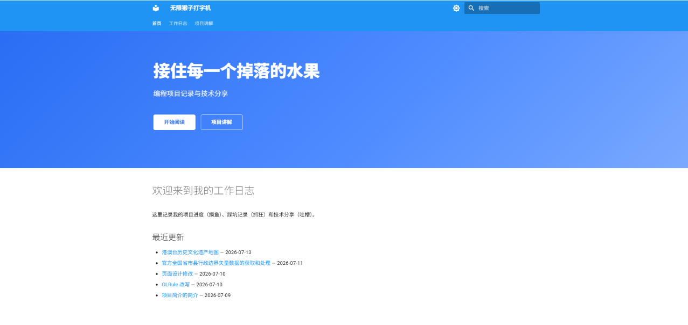
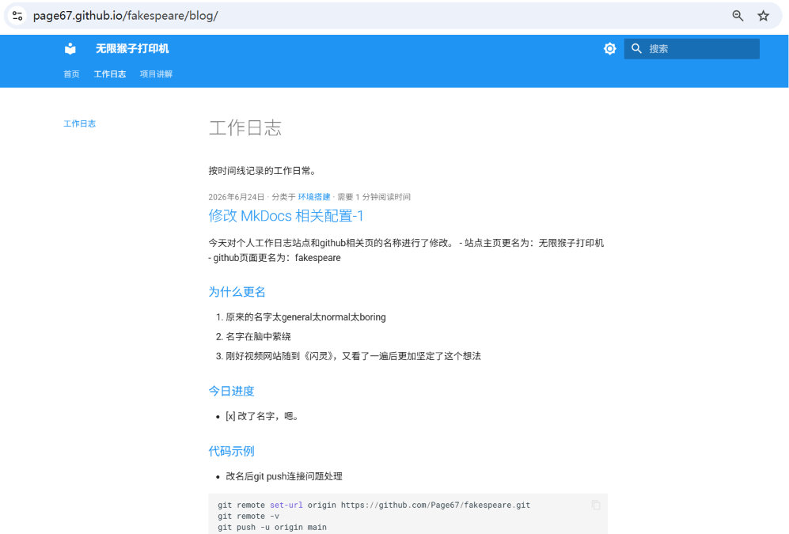

# 修改 MkDocs 相关配置-2

使用AI工具对日志站点的布局、样式、风格等设计要素进行修改。

## 感想

目前而言，生成式AI，顾名思义，适合你把素材和想法给它，然后它**一键生成**结果给你，你在其中选择。类似于你把食材（库）给后厨，它自行发挥；或者你点菜单上的某道菜。不太适合我这种自己做饭的，或者对食材处理方式、调味、卡路里、料理方式等有比较明确要求的。这种情况需要反复调整，每次结果都不太稳定，等待时间稍长，经常等不及太饿了就自己回家做了。尤其是食客比较多大排长队时后者情况就会更明显。打算隔一段时间后再试试。我也再学习一下。

根据自己的实际需求进行合适选择。

## 过程

主要处理了一下封面图。刚做完草图就觉得黑白挺好看的，但为了方便配色就想着还是先弄个彩色版。但弄完还是觉得黑白好看。又顺手试了个8-bit，最后决定用8-bit。

没采用的方案里挑了几张：

和AI的聊天（吵架）如下：

使用的AI工具包括kimi, gemini nano banana, ChatGPT image。95%的工作由kimi k3完成。

## 内容

就是改了下封面图、配色、文章显示结构等。没啥说的。贴张before-after一看便知。

Before:

After:

