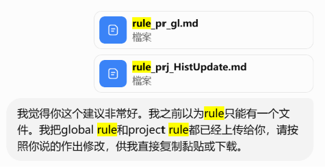
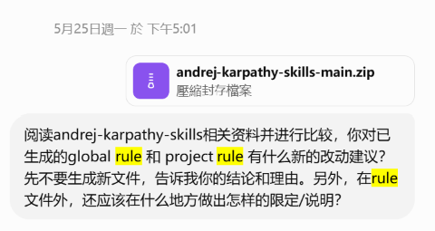
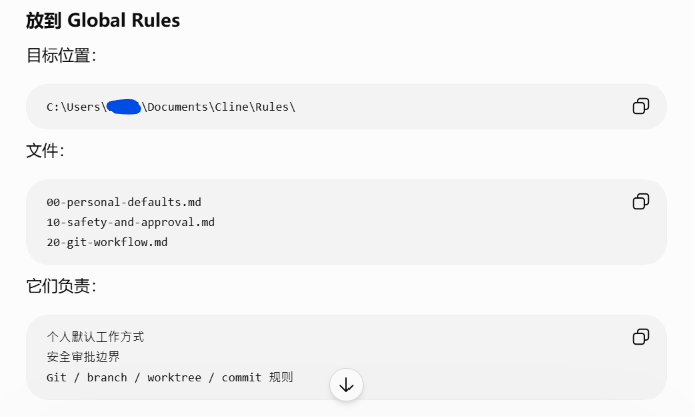
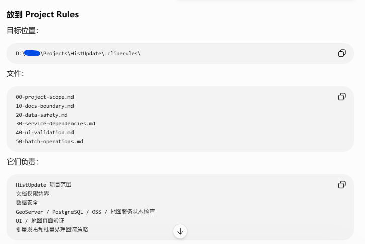
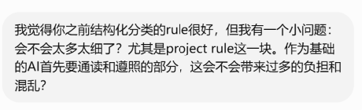

# Agent Global Rules 更改

## 前情提要

1. 背景

使用Agent辅助编程进行项目开发时，撰写 Global Rules（全局规则） 和 Project Rules（项目规则） 供给AI参考，可以更有效地推进项目顺利进行。

2. 初次交流

作者在项目开发中途先手写了一版规则，然后让AI结合26年初很有名的Andrej Karpathy给出的AI编程建议对该规则进行修改完善。AI第一次为我生成了3个全局规则文件和6个项目规则文件…… 考虑到规则文件是Agent要频繁默认读取的，而且观其内容有很多属于Skills或者workflow的部分也放到了Rule里面，作者认为不太合适。沟通后最终形成3个全局规则和2个项目规则文件。

3. 存疑

经过一段时间的开发后，尤其是观察Agent的具体思考过程后，作者此刻觉得3个全局规则文件仍显冗余，遂改之。

## 改写结果

