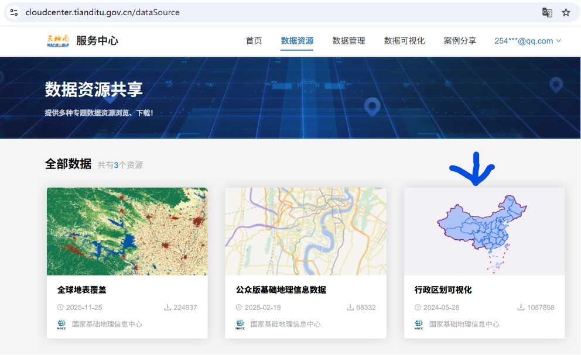
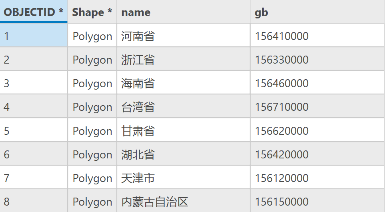
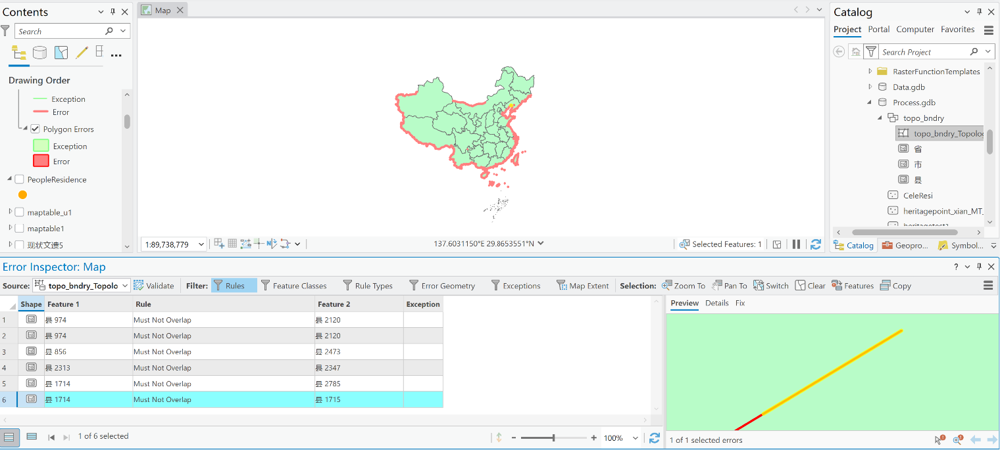

# 天地图——国家标准矢量地图的获取和处理

由于我国对地图类出版物的审查较为（粗糙的）严格，本次开发的历史地图线上项目所涉及的行政边界需采用官方发布的数据，即：天地图。

<!-- more -->

## 数据获取

1. 网站

https://www.tianditu.gov.cn/ 国家地理信息公共服务平台

2. 路径

天地图主页注册账号 → 进入数据共享中心 → 选择“行政区划可视化”板块 → 下载数据

3. 数据基础信息

| 属性 | 信息
|:---:|---|
| 审图号 | GS(2024)0605号
| 下载格式 | GeoJSON
| 数据更新时间 | 2025年9月
| 坐标系 | CGCS2000 (EPSG:4490)

4. 数据属性表

| 属性名 | 含义 | 示例
|:---:|---|---|
| name | 名称 | “河南省”；“梅州市”；“鄂城区”
| gb | 行政区划编码 | 156410000

## 检查处理

- 检查拓扑gap和overlap两项，仍然存在零星小问题，但不影响工作，懒得处理了。

- 有些飞地我不清楚是错误还是本就如此。不做处理。

## 吐槽

- 边界最后的近似处理可以说是比较丑了
- 没有基础图形外的其他属性字段，和用爱发电的一众自制边界博主比较显得就很贫乏了。不过对官方要求能达到 ==**准确、及时、方便地提供开放下载**== 大家就已经知足了。不然无据可依。——“你说我不行，整天各种理由卡我，那你倒是拿出个行的啊。”
