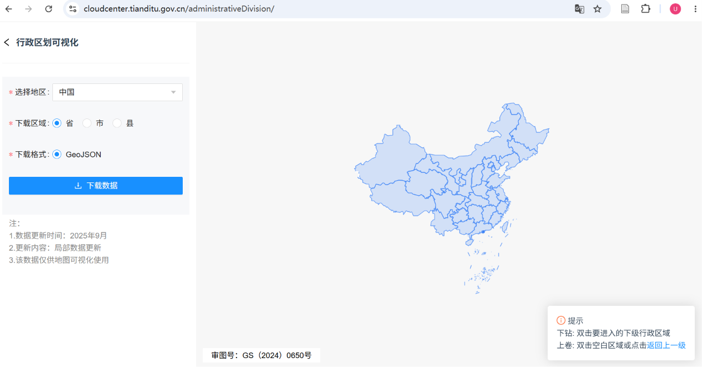

# 天地图——国家标准矢量地图的获取和处理

由于我国对地图类出版物的审查较为（粗糙的）严格，本次开发的历史地图线上项目所涉及的行政边界需采用官方发布的数据，即：天地图。


## 数据获取

1. 网站

https://www.tianditu.gov.cn/ 国家地理信息公共服务平台


2. 路径

天地图主页注册账号 → 进入数据共享中心 → 选择“行政区划可视化”板块 → 下载数据




3. 数据基础信息

| 属性 | 信息
|:---:|---|
| 审图号 | GS(2024)0605号
| 下载格式 | GeoJSON
| 数据更新时间 | 2025年9月
| 坐标系 | CGCS2000 (EPSG:4490)

4. 数据属性表

| 属性名 | 含义 | 示例
|:---:|---|---|
| name | 名称 | “河南省”；“梅州市”；“鄂城区”
| gb | 行政区划编码 | 156410000

## 检查处理

- [x] 改了名字，嗯。


## 存在问题

- [x] 改了名字，嗯。


## 代码示例

- 改名后git push连接问题处理

```powershell
git remote set-url origin https://github.com/Page67/fakespeare.git
git remote -v
git push -u origin main
```


## 吐槽

- 注册模块是傻瓜系统
- 