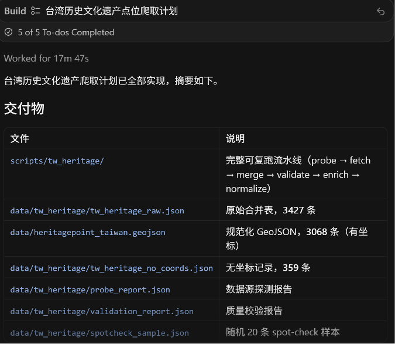
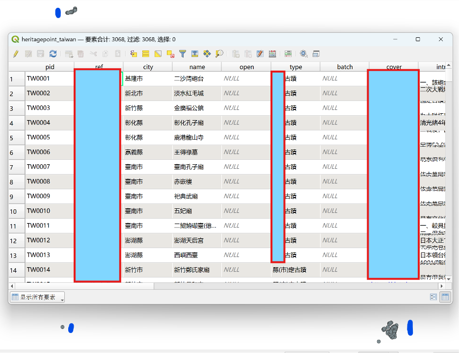
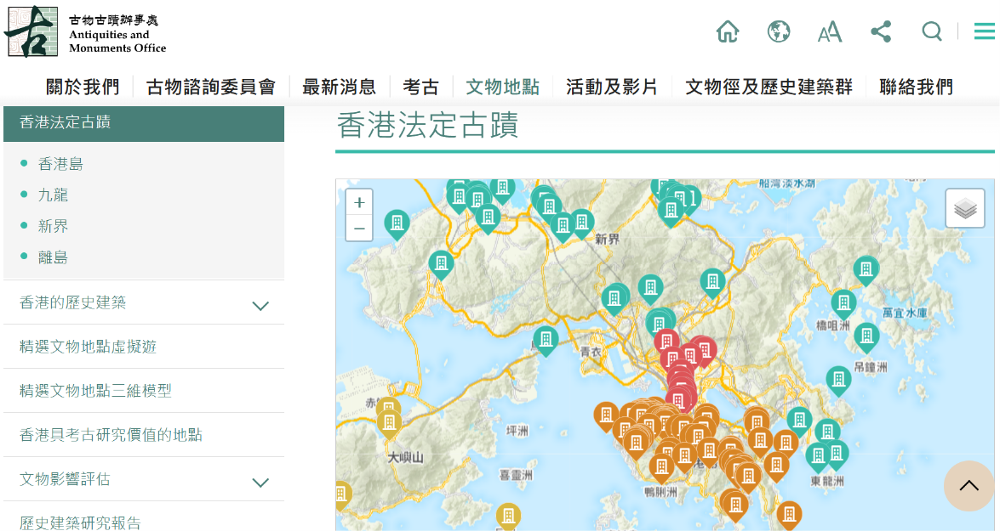

# 港澳台历史文化遗产数据

## 1. 台湾历史文化遗产数据

### 数据获取

使用Agent（注：cursor）网络爬取台湾省历史文化遗产相关页面上的数据并根据地理位置信息生成对应坐标，输出.csv表格和.geojson文件。

<!-- more -->

### 存在问题

对初始生成的文件进行预览，发现可能存在以下问题：

- 坐标生成有误
- 遗产点有重复
- 信息缺失或信息有误
- 和官方行政边界存在差异
- 分类标准不一致
- 其他问题

### 处理说明

由于项目仍处于第一版状态，临近发布，目前也没有合适的官方资料作为参考，此次仅对行政边界和一些明显错误进行处理。简单的数据对齐原则在项目发布时会给予简略说明。

## 2. 香港历史文化遗产数据

1. 数据来源

    https://www.amo.gov.hk/tc/historic-buildings/monuments/index.html 

    

2. 处理说明

    简单的数据对齐原则在项目发布时会给予简略说明。

## 3. 澳门历史文化遗产数据

1. 数据来源

    https://www.culturalheritage.mo/

    

2. 处理说明

    简单的数据对齐原则在项目发布时会给予简略说明。

